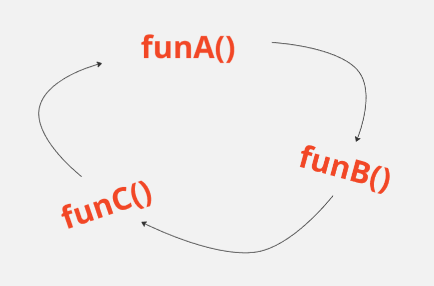

# **Indirect Recursion**

### Definition:
<p>
In this recursion, there may be more than one functions and they are calling one another in a circular manner.



From the above diagram `funA()` is calling for `funB()`, `funB()` is calling for `funC()` and `funC()` is calling for `funA()` and thus it makes a cycle.
</p>

---

### Code:
```java
public class IndirectRecursion {
    static void funA(int n) {
        if (n > 0) {
            System.out.print(" " + n);
            funB(n - 1);
        }
    }

    static void funB(int n) {
        if (n > 1) {
            System.out.print(" " + n);
            funA(n / 2);
        }
    }

    public static void main(String[] args) {
        funA(20);
    }
}
```

---

### Step-by-Step Execution:

1. **Initial Call**:
   - `main` calls `funA(20)`.

2. **First Call: `funA(20)`**:
   - `n = 20 > 0`, so it prints `20`.
   - Calls `funB(20 - 1)` → `funB(19)`.

3. **Second Call: `funB(19)`**:
   - `n = 19 > 1`, so it prints `19`.
   - Calls `funA(19 / 2)` → `funA(9)`.

4. **Third Call: `funA(9)`**:
   - `n = 9 > 0`, so it prints `9`.
   - Calls `funB(9 - 1)` → `funB(8)`.

5. **Fourth Call: `funB(8)`**:
   - `n = 8 > 1`, so it prints `8`.
   - Calls `funA(8 / 2)` → `funA(4)`.

6. **Fifth Call: `funA(4)`**:
   - `n = 4 > 0`, so it prints `4`.
   - Calls `funB(4 - 1)` → `funB(3)`.

7. **Sixth Call: `funB(3)`**:
   - `n = 3 > 1`, so it prints `3`.
   - Calls `funA(3 / 2)` → `funA(1)`.

8. **Seventh Call: `funA(1)`**:
   - `n = 1 > 0`, so it prints `1`.
   - Calls `funB(1 - 1)` → `funB(0)`.

9. **Eighth Call: `funB(0)`**:
   - `n = 0`, so the function returns immediately without doing anything.

10. **Backtracking**:
    - Once `funB(0)` returns, all previous recursive calls unwind, and no further operations are performed.

---

### Output:
```
 20 19 9 8 4 3 1
```

---

### Explanation of Output:
1. **Flow of Calls**:
   - The functions `funA` and `funB` alternate, recursively reducing `n` either by subtraction (`n - 1`) or division (`n / 2`).

2. **Base Cases**:
   - `funA` stops recursion when `n <= 0`.
   - `funB` stops recursion when `n <= 1`.

3. **Numbers Printed**:
   - The sequence of printed numbers corresponds to the arguments passed to `funA` and `funB`.

---

### Summary:
The recursion alternates between `funA` and `funB`:
- `funA` reduces `n` by calling `funB(n - 1)`.
- `funB` reduces `n` by calling `funA(n / 2)`.

This creates a sequence of alternating operations, ultimately printing the numbers: `20, 19, 9, 8, 4, 3, 1`.

---